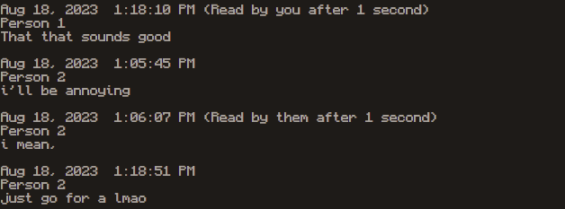

# CanGPT

This is the small sized GPT trained on a real conversation I extracted from my iMessage history with a friend of mine. It is based on Andrej Karpathy's [nanoGPT](https://github.com/karpathy/nanoGPT). The entire training process took about 50 minutes on a single GPU since it's a 1/10 of the original training at Karpathy's link since my 5 year old 2060 cannot handle the full size.

# Sample Output

# Limitations 

This a conversation between two CS majors at Tech, with little to no cleaning done prior besides taking names out. The conversation is also very short, so the model is not very good at generating long responses. It also has a tendency to make grammatical mistakes, which is to be expected.

# Command-line prompts to run the code

!python train.py train_cangpt.py
!python sample.py --out_dir=canGPT  
